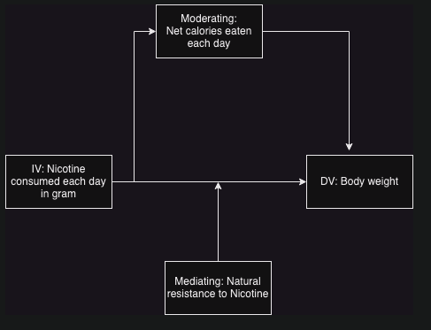

```{r setup, include=FALSE}
knitr::opts_chunk$set(echo = TRUE)
```


\tableofcontents


# Part 1 - Design and set-up of true experiment 


## The motivation for the planned research 
(Max 200 words)

Researchers found that Nicotine caused weight loss in [<span style="color:blue">rats</span>](https://www.sciencedirect.com/science/article/abs/pii/0014299976902016) and then later in [<span style="color:blue">humans</span>](https://onlinelibrary.wiley.com/doi/abs/10.1111/j.1360-0443.1991.tb01810.x). Morean and Wedel [<span style="color:blue">noticed</span>](https://www.sciencedirect.com/science/article/pii/S0306460316303781?casa_token=Fuxiv7q95AwAAAAA:obMaLgmaIEyb-eH0Bb-_x-rL0bLz-ox_8eXxWqSw6gScAA7dnlXkUMgyfJO3v2gatjjAPio8Rx0) that 13.5% of adults in USA vape to lose weight.

## The theory underlying the research  
(Max 200 words) Preferable based on theories reported in literature

There are a few theories for how Nicotine reduces weight through [<span style="color:blue">Leptin</span>](https://www.sciencedirect.com/science/article/pii/S0195666321001677?casa_token=-HTtrT14rR0AAAAA:KI3zc_yYySluosZSz2MJrDsdsF-yTb8MOIqKaUtYKA6Ug_QOOo1iRGys0zYQweEEf54SRgoESjY), [<span style="color:blue">fight-or-flight receptors</span>](https://www.npr.org/2011/06/09/137085989/the-skinny-on-smoking-why-nicotine-curbs-appetite) but also indications that weight should increase through [<span style="color:blue">Ghrelin</span>](https://www.sciencedirect.com/science/article/pii/S0195666321001677?casa_token=-HTtrT14rR0AAAAA:KI3zc_yYySluosZSz2MJrDsdsF-yTb8MOIqKaUtYKA6Ug_QOOo1iRGys0zYQweEEf54SRgoESjY). However, all of these sources note that there is empirical evidence showing strong correlation between Nicotine consumption and weight loss. We will not go into the different theories in Biology for how this happens. Instead, we noticed that these papers did not always look at how the Nicotine was consumed i.e. through vaping, patches, injection, etc.

## Research questions 
The research question that will be examined in an experiment (or alternatively the hypothesis that will be tested in an  experiment)

Research Question: Does consuming Nicotine through vape cause more weight loss than patch?

## The related conceptual model 
This model should include:

*Independent variable(s):* Nicotine consumed each day in gram
Nicotine will be carefully measured and administered to the participant

*Dependent variable:* Body weight
The body weight of the patient will change and needs to be measured.

*Moderating variable (at least 1):* Resistance to Nicotine by body
Some people are naturally more resistant to Nicotine than others. To achieve the same effect, different people can require different amounts of Nicotine.

*Mediating variable (at least 1):* Net calories eaten each day
The net intake of calories (calories eaten - calories used from exercise and other activities) will increase, decrease or will not change body weight.

There are some other variables in the real world that complicate such an experiment. We will ignore diabetes, age, eating restrictions and other conditions like paralysis.



## Experimental Design 
Experimental Design (the study should have a true experimental design to test a single hypothesis that, for simplicity, includes only independent variable(s) and dependent variable(s). In other words, mediating and moderating variables are not included in the experimental design) 

The experiment is to determine if method of consuming Nicotine affects weight loss. All participants will consume nicotine in one of three ways and data collected will be analyzed to check for statistical significance.

## Experimental procedure 
Describe how the experiment will be executed step by step

Use "post-test-only two treatment comparison"
- Measure weight of all participants (at a specific time of day such as before lunch at 12:00)
- Start treatment by assigning users randomly to patch or vaping group with equal probability. All the groups will start consuming Nicotine in linearly increasing amounts. The amount will increase at the same rate for everybody till a pre-determined level through their respective sources of patch or vape. (between subject design).
- The nicotine consumed for all participants on any day will always be the same.
- After Nicotine consumption has reached pre-determined target level, stop.
- Measure weight of all participants once again in the same situation as before in point 1
- Possible values can be that each participant initially consumes 5mg of Nicotine each day. Every week the amount is increased by 2mg till 15mg/day is reached.
- To address history threats, all participants should only perform the same amount of exercise (so that the weight loss can only be from Nicotine). We are already monitoring calories eaten so that is accounted for.
- To address mortality threat, recruit extra participants to the study.

## Measures
Describe the measure that will be used

The delta in body weight (Weight at end of experiment - weight at start of experiment). The dataset will be two array of floats (one array for delta in weight for vaping and other for delta in weight in patch).

## Participants
Describe which participants will recruit in the study and how they will be recruited

Users that do not consume Nicotine are ideal for this experiment because users that consume Nicotine can have developed resistance to Nicotine. They can be recruited through social media and flyers in different parts of the country and cities to attract a diverse group of participants. StackOverflow [<span style="color:blue">says</span>](https://stats.stackexchange.com/questions/37993/is-there-a-minimum-sample-size-required-for-the-t-test-to-be-valid) says t-test is designed for small sample sizes and there is no minimum size. Intuitively, a few hundred participants should be sufficient, more are welcome.

## Suggested statistical analyses
Describe the statistical test you suggest to care out on the collected data.

t-test: The standard textbook t-test will be applied to determine if the results are statistically significant. t-test is selected because we want to compare two populations to test a hypothesis. If the number of participants is sufficiently large i.e. it can be turned into a standard normal distribution, z-test can be used.

# Part 2 - Generalized linear models

## Question 1 Twitter sentiment analysis (Between groups - single factor) 

### Conceptual model
Make a conceptual model for the following research question: Is there a difference in the sentiment of the tweets related to the different individuals/organisations?


### Model description

Describe the mathematical model fitted on the most extensive model. (hint, look at the mark down file of the lectures to see example on formulate mathematical models in markdown). Assume a Gaussian distribution for the tweet’s sentiments rating. Justify the priors.

### Generate Synthetic data
Create a synthetic data set with a clear difference between tweets’ sentiments of celebrities for verifying your analysis later on. Report the values of the coefficients of the linear model used to generate synthetic data. (hint, look at class lecture slides of lecture on Generalized linear models for example to create synthetic data)


```{r}
#include your code for generating the synthetic data
synthetic_data <- data.frame(Candidate=character(), score=integer())

n_c <- 3
n_p <- 100
B0 <- 0
B1_c <- rnorm(n_c, 0, 3)
Trump <- rnorm(n_p, -2, 3)
Hillary <- rnorm(n_p, 0, 4)
Bernie <- rnorm(n_p, 2, 2)

labels=c("Donald Trump", "Hillary Clinton", "Bernie Sanders")
for (i in 1:n_p) {
  x1 <- runif(1, -5, 5)
  err <- rnorm(1, 0, 0.3)
  l_m <- Trump[i] + err
  newrow <- data.frame(Candidate=labels[1], score=round(l_m, 0))
  synthetic_data <- rbind(synthetic_data,newrow)
}
for (i in 1:n_p) {
  x1 <- runif(1, -5, 5)
  err <- rnorm(1, 0, 0.3)
  l_m <- Hillary[i] + err
  newrow <- data.frame(Candidate=labels[2], score=round(l_m, 0))
  synthetic_data <- rbind(synthetic_data,newrow)
}
for (i in 1:n_p) {
  x1 <- runif(1, -5, 5)
  err <- rnorm(1, 0, 0.3)
  l_m <- Bernie[i] + err
  newrow <- data.frame(Candidate=labels[3], score=round(l_m, 0))
  synthetic_data <- rbind(synthetic_data,newrow)
}
```

### Collecting tweets, and data preparation
Include the annotated R script (excluding your personal Keys and Access Tokens information), but put echo=FALSE, so code is not included in the output pdf file.


```{r, echo=FALSE, message=FALSE, warning=FALSE, include = FALSE}

#during writing you could add "eval = FALSE",  kntr will than not run this code chunk (take some time do)

#setwd("C:\Users\Andrej\Documents\School\Q4\SeminarResearchMethod") 
# apple , note use / instead of \, which used by windows


#install.packages("twitteR", dependencies = TRUE)
library(twitteR)
#install.packages("RCurl", dependencies = T)
library(RCurl)
#install.packages("bitops", dependencies = T)
library(bitops)
#install.packages("plyr", dependencies = T)
library(plyr)
#install.packages('stringr', dependencies = T)
library(stringr)
#install.packages("NLP", dependencies = T)
library(NLP)
#install.packages("tm", dependencies = T)
library(tm)
#install.packages("wordcloud", dependencies=T)
#install.packages("RColorBrewer", dependencies=TRUE)
library(RColorBrewer)
library(wordcloud)
#install.packages("reshape", dependencies=T)
library(reshape)
library(stringi)

################### functions
#setwd("C:\\Users\\Andrej\\Documents\\School\\Q4/SeminarResearchMethod\\")
#Lec4a <- read.spss("examples_Chi.sav", use.value.labels=TRUE, to.data.frame=TRUE)
#tweets_T <- read.delim("tweets_T.txt", sep = "")

tweet_T_string = readLines("tweets_T.txt")[nchar(readLines("tweets_T.txt")) > 7]
tweets_T_cols = stri_split_fixed(str = tweet_T_string, pattern=":", n=2)
tweets_T_cols = do.call(rbind, tweets_T_cols)
tweets_T = data.frame(tweets_T_cols)

tweet_C_string = readLines("tweets_C.txt")[nchar(readLines("tweets_C.txt")) > 7]
tweets_C_cols = stri_split_fixed(str = tweet_C_string, pattern=":", n=2)
tweets_C_cols = do.call(rbind, tweets_C_cols)
tweets_C = data.frame(tweets_C_cols)

tweet_B_string = readLines("tweets_B.txt")[nchar(readLines("tweets_B.txt")) > 7]
tweets_B_cols = stri_split_fixed(str = tweet_B_string, pattern=":", n=2)
tweets_B_cols = do.call(rbind, tweets_B_cols)
tweets_B = data.frame(tweets_B_cols)


#taken from https://github.com/mjhea0/twitter-sentiment-analysis
pos <- scan('positive-words.txt', what = 'character', comment.char=';') #read the positive words
neg <- scan('negative-words.txt', what = 'character', comment.char=';') #read the negative words

source("sentiment3.R") #load algorithm
# see sentiment3.R form more information about sentiment analysis. It assigns a intereger score
# by subtracting the number of occurrence of negative words from that of positive words

analysis_T <- score.sentiment(tweets_T$X2, pos, neg)
analysis_C <- score.sentiment(tweets_C$X2, pos, neg)
analysis_B <- score.sentiment(tweets_B$X2, pos, neg)


sem<-data.frame(analysis_T$score, analysis_C$score, analysis_B$score)


semFrame <-melt(sem, measured=c(analysis_T.score,analysis_C.score, analysis_B.score ))
names(semFrame) <- c("Candidate", "score")
semFrame$Candidate <-factor(semFrame$Candidate, labels=c("Donald Trump", "Hillary Clinton", "Bernie Sanders"))

#The data you need for the analyses can be found in semFrame

```

### Visual inspection Mean and distribution sentiments
Graphically examine the mean and distribution sentiments of tweets for each individual/organisation, and provide interpretation

```{r}
#include your analysis code and output in the document
boxplot(score ~ Candidate, data=semFrame, main="Sentiment", xlab="Candidate", ylab="Sentiment score")
boxplot(score ~ Candidate, data=synthetic_data, main="Sentiment", xlab="Candidate", ylab="Sentiment score")
```

### Frequentist approach

#### Analysis verification
Verify your model analysis with synthetic data and show that it can reproduce the coefficients of the linear model that you used to generate the synthetic data set. Provide a short interpretation of the results, with a reflection of AICc, F-value, p-value etc.

```{r}
#include your analysis code of synthetic data and output in the document synth_data
baseModel <- lm(score ~ 1, data=synthetic_data)
candidateModel <- lm(score ~ Candidate, data=synthetic_data)
anova(baseModel, candidateModel, test = "F")
pander(anova(candidateModel))
pander(summary(candidateModel))
```


#### Linear model
Redo the analysis now on the real tweet data set. Provide a short interpretation of the results, with an interpretation of AICc, F-value, p-value, etc.

```{r}
#include your analysis code and output in the document
baseModel <- lm(score ~ 1, data=semFrame)
candidateModel <- lm(score ~ Candidate, data=semFrame)
anova(baseModel, candidateModel, test = "F")
pander(anova(candidateModel))
#aictab(cand.set = c(baseModel, candidateModel), modnames=c("baseModel", "candidateModel"))
```

#### Post Hoc analysis
If a model that includes the individual better explains the sentiments of tweets than a model without such predictor, conduct a posthoc analysis with, e.g., Bonferroni correction to examine which celebrity tweets differ from the other individual’s tweets. Provide a brief interpretation of the results.

```{r}
#include your code and output in the document
pairwise.t.test(semFrame$score, semFrame$Candidate, 
                paired = FALSE, p.adjust.method = "bonferroni")
aov_model <- aov(score ~ Candidate, data = semFrame)
pander(TukeyHSD(model))
```

#### Report section for a scientific publication
Write a small section for a scientific publication (journal or a conference), in which you report the results of the analyses, and explain the conclusions that can be drawn in a format commonly used by the scientific community Look at Brightspace for examples papers and guidelines on how to do this. (Hint, there are strict guidelines for reporting statistical results in paper, I expect you to follow these here) 

### Bayesian Approach
For the Bayesian analyses, use the rethinking and/or BayesianFirstAid library
#### Analysis verification
Verify your model analysis with synthetic data and show that it can reproduce the coefficients of the linear model that you used to generate the synthetic data set. Provide a short interpretation of the results, with a reflection of WAIC, and 95% credibility interval of coefficients for individual celebrities.

```{r}
#include your analysis code of synthetic data and output in the document
```

#### Model comparison
Redo the analysis on the actual tweet data set. Provide a short interpretation of the results, with a reflection of WAIC, and 95% credibility interval of coefficients for individual celebrities.

```{r}
#include your code and output in the document
```

#### Comparison individual/organisation pair
Compare sentiments of individual pairs and provide a brief interpretation (e.g. CIs) 

```{r}
#include your code and output in the document
```

## Question 2 - Website visits (between groups - Two factors)

### Conceptual model
Make a conceptual model underlying this research question

### Specific Mathematical model
Describe the mathematical model that you fit on the data. Take for this the complete model that you fit on the data. Also, explain your selection for the priors. Assume Gaussian distribution for the number of page visits.

### Create Synthetic data
Create a synthetic data set with a clear interaction effect between the two factors for verifying your analysis later on. Report the values of the coefficients of the linear model used to generate synthetic data.

```{r}
#include your code for generating the synthetic data
```


### Visual inspection
Graphically examine the mean page visits for the four different conditions. Give a short explanation of the figure.


```{r}
#include your code and output in the document
```


### Frequentist Approach

#### Model verification
Verify your model analysis with synthetic data and show that it can reproduce the coefficients of the linear model that you used to generate the synthetic data set. Provide a short interpretation of the results, with a reflection of AICc, F-value, p-value etc.

```{r}
#include your analysis code of synthetic data and output in the document
```

#### Model analysis with Gaussian distribution assumed
Redo the analysis now on the real data set. Assume Gaussian distribution for the number of page visits. Provide a short interpretation of the results, with an interpretation of AICc, F-value, p-value, etc.


```{r}
#include your code and output in the document
```

#### Assumption analysis
Redo the analysis on the real tweet data set.  This time assume a Poisson distribution for the number of page visits. For the best fitting models (Gaussian and Poisson), examine graphically the distribution of the residuals for the model that assumes Gaussian distribution and the model that assumes Poisson distribution. Give a brief interpretation of Poisson and Gaussian distribution assumptions.

```{r}
#include your code and output in the document
```


#### Simple effect analysis
Continue with the model that assumes a Poisson distribution. If the analysis shows a significant two-way interaction effect, conduct a Simple Effect analysis to explore this interaction effect in more detail. Provide a brief interpretation of the results.


```{r}
#include your code and output in the document
```


#### Report section for a scientific publication
Write a small section for a scientific publication, in which you report the results of the analyses, and explain the conclusions that can be drawn.

### Bayesian Approach
For the Bayesian analyses, use the rethinking and/or BayesianFirstAid library

####  Verification Analysis
Verify your model analysis with synthetic data and show that it can reproduce the coefficients of the linear model that you used to generate the synthetic data set. Provide a short interpretation of the results, with a reflection of WAIC, and 95% credibility interval of coefficients for individual celebrities.


```{r}
#include your analysis code of synthetic data and output in the document
```


#### Model description

Describe the mathematical model fitted on the most extensive model. (hint, look at the mark down file of the lectures to see example on formulate mathematical models in markdown). Assume Poisson distribution for the number of page visits. Justify the priors.

#### Model comparison

Redo the analysis on actual data. Assume Poisson distribution for the number of page visits. Provide brief interpretation of the analysis results (e.g. WAIC, and 95% credibility interval of coefficients).

```{r}
#include your code and output in the document
```


# Part 3 - Multilevel model

## Visual inspection
Use graphics to inspect the distribution of the score, and relationship between session and score. Give a short description of the figure.


```{r}
#include your code and output in the document
library(car)
set = read.csv("set1.csv")
scatterplot(score ~ session, data = set)
```

## Frequentist approach

### Multilevel analysis
Conduct multilevel analysis and calculate 95% confidence intervals thereby assuming a Gaussian distribution for the scores, determine:

* If session has an impact on people score
* If there is significant variance between the participants in their score


```{r}
#include your code and output in the document
library(nlme)
randomIntercept <- lme(score ~ 1, data = set, random = ~1|subject, method = "ML", control = list(opt="optim"))
randomSession <- update(randomIntercept, .~. + session)
sessionSubject <- update(randomSession, random = ~session|subject)
ARModel <- update(sessionSubject, correlation = corAR1(0, form = ~session|subject))
#summary(randomIntercept)
anova.lme(randomIntercept,randomSession, sessionSubject, ARModel)
summary(randomSession)
intervals(randomSession, 0.95)
```


```{r}
m0 <- ulam( 
  alist(
    #Likelihood
    score ~ dnorm(mu, sigma),
    #linear model
    mu <- a ,
    #fixed priors
    a ~ dnorm(5.5, 2),
    sigma ~ dcauchy(0, 1)
  ), data = set, iter = 10000, chains = 4, cores = 4, log_lik = TRUE
)

m1 <- ulam( 
  alist(
    #Likelihood
    score ~ dnorm(mu, sigma),
    #linear model
    mu <- a + a_subject[subject],
    #adaptive prior
    a_subject[subject] ~ dnorm(0, sigma_subject),
    #hyper prior
    sigma_subject ~ dcauchy(0, 1),
    #fixed priors
    a ~ dnorm(5.5, 2),
    sigma ~ dcauchy(0, 1) 
  ), data = set, iter = 10000, chains = 4, cores = 4, log_lik = TRUE, control=list(adapt_delta=.99) 
)

m2 <- ulam( 
  alist(
    #Likelihood
    score ~ dnorm(mu, sigma),
    #linear model
    mu <- a + a_subject[subject] + b*session,
    #adaptive prior
    a_subject[subject] ~ dnorm(0, sigma_subject),
    #hyper prior
    sigma_subject ~ dcauchy(0, 1),
    #fixed priors
    a ~ dnorm(5.5, 2),
    b ~ dnorm(0, 1), 
    sigma ~ dcauchy(0, 1)
  ), data = set, iter = 10000, chains = 4, cores = 4, log_lik = TRUE, control=list(adapt_delta=.99)
)
```


```{r}
plot(compare(m0,m1,m2))
plot(precis(m2, prob=.95))
```

### Report section for a scientific publication
Write a small section for a scientific publication, in which you report the results of the analyses, and explain the conclusions that can be drawn.

## Bayesian approach
For the Bayesian analyses, use the rethinking and/or BayesianFirstAid library

### Model description

Describe the mathematical model fitted on the most extensive model. (hint, look at the mark down file of the lectures to see example on formulate mathematical models in markdown).  Assume a Gaussian distribution for the scores. Justify the priors.

### Model comparison

Compare models with with increasing complexity. 

```{r}
#include your code and output in the document
```

### Estimates examination

Examine the estimate of parameters of the model with best fit, and provide a brief interpretation.


```{r}
#include your code and output in the document
```


