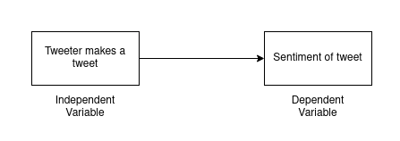
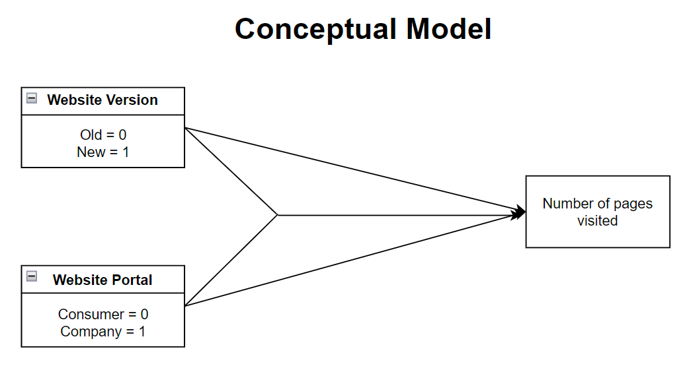

```{r setup, include=FALSE}
knitr::opts_chunk$set(echo = TRUE)
```

\tableofcontents

# Part 1 - Design and set-up of true experiment 


## The motivation for the planned research 
(Max 200 words)

Researchers found that Nicotine caused weight loss in [<span style="color:blue">rats</span>](https://www.sciencedirect.com/science/article/abs/pii/0014299976902016) and then later in [<span style="color:blue">humans</span>](https://onlinelibrary.wiley.com/doi/abs/10.1111/j.1360-0443.1991.tb01810.x). Morean and Wedel [<span style="color:blue">noticed</span>](https://www.sciencedirect.com/science/article/pii/S0306460316303781?casa_token=Fuxiv7q95AwAAAAA:obMaLgmaIEyb-eH0Bb-_x-rL0bLz-ox_8eXxWqSw6gScAA7dnlXkUMgyfJO3v2gatjjAPio8Rx0) that 13.5% of adults in USA vape to lose weight.

## The theory underlying the research  
(Max 200 words) Preferable based on theories reported in literature

There are a few theories for how Nicotine reduces weight through [<span style="color:blue">Leptin</span>](https://www.sciencedirect.com/science/article/pii/S0195666321001677?casa_token=-HTtrT14rR0AAAAA:KI3zc_yYySluosZSz2MJrDsdsF-yTb8MOIqKaUtYKA6Ug_QOOo1iRGys0zYQweEEf54SRgoESjY), [<span style="color:blue">fight-or-flight receptors</span>](https://www.npr.org/2011/06/09/137085989/the-skinny-on-smoking-why-nicotine-curbs-appetite) but also indications that weight should increase through [<span style="color:blue">Ghrelin</span>](https://www.sciencedirect.com/science/article/pii/S0195666321001677?casa_token=-HTtrT14rR0AAAAA:KI3zc_yYySluosZSz2MJrDsdsF-yTb8MOIqKaUtYKA6Ug_QOOo1iRGys0zYQweEEf54SRgoESjY). However, all of these sources note that there is empirical evidence showing strong correlation between Nicotine consumption and weight loss. We will not go into the different theories in Biology for how this happens. Instead, we noticed that these papers did not always look at how the Nicotine was consumed i.e. through vaping, patches, injection, etc.

## Research questions 
The research question that will be examined in an experiment (or alternatively the hypothesis that will be tested in an  experiment)

Research Question: Does consuming Nicotine in different ways cause different amounts of weight loss?

## The related conceptual model 
This model should include:
*Independent variable(s): Nicotine consumed each day in gram
*Dependent variable: Body weight
*Mediating variable (at least 1): Resistance to Nicotine by body
*Moderating variable (at least 1): Net calories eaten each day

There are some other variables in the real world that complicate such an experiment. We will ignore diabetes, age, eating restrictions and other conditions like paralysis.

## Experimental Design 
Experimental Design (the study should have a true experimental design to test a single hypothesis that, for simplicity, includes only independent variable(s) and dependent variable(s). In other words, mediating and moderating variables are not included in the experimental design ) 

The experiment is to determine if method of consuming Nicotine affects weight loss. All participants will consume nicotine in one of three ways and data collected will be analyzed to check for statistical significance.

## Experimental procedure 
Describe how the experiment will be executed step by step

- Start collecting weight data about participants before starting experiment to estabilish normal habits.
- Start treatment by assigning users to patch, injection and vaping group. All the groups will slowly start consuming Nicotine linearly increasing at the same rate for everybody till a pre-determined level through their respective sources of patch, injection or vape.
- The nicotine consumed will for all participants on any day will always be the same.
- Continue collecting weight data and participants should continue their regular schedules as before starting the experiment (eg: if somebody went to the gym twice a week, they should still do that as this will eliminate many variables that can affect body weight)
- After Nicotine consumption of experiment group has reached pre-determined level, maintain constant nicotine consumption and collect weight data for some more days to confirm the trend

## Measures
Describe the measure that will be used

Change in body weight from starting consuming Nicotine.

## Participants
Describe which participants will recruit in the study and how they will be recruited

Users that do not consume Nicotine. Users that consume can also be used but there can be other factors involved like the body adapting to the Nicotine and responding less or not responding at all.

## Suggested statistical analyses
Describe the statistical test you suggest to care out on the collected data

t-test. Compare weight lost between the three types of consuming nicotine to see if some perform statistically better at losing weight than others.

# Part 2 - Generalized linear models

## Question 1 Twitter sentiment analysis (Between groups - single factor) 

### Conceptual model
Make a conceptual model for the following research question: Is there a difference in the sentiment of the tweets related to the different individuals/organisations?
```{r}

```

### Model description

Describe the mathematical model fitted on the most extensive model.
(hint, look at the mark down file of the lectures to see example on
formulate mathematical models in markdown). Assume a Gaussian
distribution for the tweet's sentiments rating. Justify the priors.

We will use the following linear model:

$score \sim Norm(\mu, \sigma)$ [likelihood]

$\mu = a+b*Candidate$ [linear model]

$a \sim Norm(100, 25)$ [$a$ Intercept]

$b \sim Norm(0,1)$ [$b$ prior]

### Generate Synthetic data

Create a synthetic data set with a clear difference between tweets'
sentiments of celebrities for verifying your analysis later on. Report
the values of the coefficients of the linear model used to generate
synthetic data. (hint, look at class lecture slides of lecture on
Generalized linear models for example to create synthetic data)

The mean and SD for each candidate are: Trump = (-2, 1.5), Bernie = (3, 1) and Hillary = (0, 2)

```{r}
#include your code for generating the synthetic data
synthetic_data <- data.frame(Candidate=character(), score=integer(), 
                       stringsAsFactors = TRUE)

n_c <- 3
n_p <- 100
B0 <- 0
B1_c <- rnorm(n_c, 0, 3)

Trump <- rnorm(n_p, 0, 1.5)
Hillary <- rnorm(n_p, 0, 2)
Bernie <- rnorm(n_p, 0, 1)
cintercepts <- c(-2, 0, 3)

labels=c("Donald Trump", "Hillary Clinton", "Bernie Sanders")
for (i in 1:n_p) {
  err <- rnorm(1, 0, 1)
  l_m <- B0 + cintercepts[1] + Trump[i] + err
  newrow <- data.frame(Candidate=labels[1], score=round(l_m, 0))
  synthetic_data <- rbind(synthetic_data,newrow)
}
for (i in 1:n_p) {
  err <- rnorm(1, 0, 1)
  l_m <- B0 + cintercepts[2] + Hillary[i] + err
  newrow <- data.frame(Candidate=labels[2], score=round(l_m, 0))
  synthetic_data <- rbind(synthetic_data,newrow)
}
for (i in 1:n_p) {
  err <- rnorm(1, 0, 1)
  l_m <- B0 + cintercepts[3] + Bernie[i] + err
  newrow <- data.frame(Candidate=labels[3], score=round(l_m, 0))
  synthetic_data <- rbind(synthetic_data,newrow)
}
```

### Collecting tweets, and data preparation

Include the annotated R script (excluding your personal Keys and Access
Tokens information), but put echo=FALSE, so code is not included in the
output pdf file.

```{r, echo=TRUE, message=FALSE, warning=FALSE, results='hide'}
#during writing you could add "eval = FALSE",  kntr will than not run this code chunk (take some time do)

#setwd("C:\Users\Andrej\Documents\School\Q4\SeminarResearchMethod") 
# apple , note use / instead of \, which used by windows
library(rethinking)
library(BayesianFirstAid)
library(pander)
#install.packages("twitteR", dependencies = TRUE)
library(twitteR)
#install.packages("RCurl", dependencies = T)
library(RCurl)
#install.packages("bitops", dependencies = T)
library(bitops)
#install.packages("plyr", dependencies = T)
library(plyr)
#install.packages('stringr', dependencies = T)
library(stringr)
#install.packages("NLP", dependencies = T)
library(NLP)
#install.packages("tm", dependencies = T)
library(tm)
#install.packages("wordcloud", dependencies=T)
#install.packages("RColorBrewer", dependencies=TRUE)
library(RColorBrewer)
library(wordcloud)
#install.packages("reshape", dependencies=T)
library(reshape)
library(stringi)
library(AICcmodavg) #aictab
```

```{r, echo=TRUE, message=FALSE, warning=FALSE}


################### functions
#setwd("C:\\Users\\Andrej\\Documents\\School\\Q4/SeminarResearchMethod\\")
#Lec4a <- read.spss("examples_Chi.sav", use.value.labels=TRUE, to.data.frame=TRUE)
#tweets_T <- read.delim("tweets_T.txt", sep = "")

tweet_T_string = readLines("tweets_T.txt")[nchar(readLines("tweets_T.txt")) > 7]
tweets_T_cols = stri_split_fixed(str = tweet_T_string, pattern=":", n=2)
tweets_T_cols = do.call(rbind, tweets_T_cols)
tweets_T = data.frame(tweets_T_cols)

tweet_C_string = readLines("tweets_C.txt")[nchar(readLines("tweets_C.txt")) > 7]
tweets_C_cols = stri_split_fixed(str = tweet_C_string, pattern=":", n=2)
tweets_C_cols = do.call(rbind, tweets_C_cols)
tweets_C = data.frame(tweets_C_cols)

tweet_B_string = readLines("tweets_B.txt")[nchar(readLines("tweets_B.txt")) > 7]
tweets_B_cols = stri_split_fixed(str = tweet_B_string, pattern=":", n=2)
tweets_B_cols = do.call(rbind, tweets_B_cols)
tweets_B = data.frame(tweets_B_cols)


#taken from https://github.com/mjhea0/twitter-sentiment-analysis
pos <- scan('positive-words.txt', what = 'character', comment.char=';') #read the positive words
neg <- scan('negative-words.txt', what = 'character', comment.char=';') #read the negative words

source("sentiment3.R") #load algorithm
# see sentiment3.R form more information about sentiment analysis. It assigns a intereger score
# by subtracting the number of occurrence of negative words from that of positive words

analysis_T <- score.sentiment(tweets_T$X2, pos, neg)
analysis_C <- score.sentiment(tweets_C$X2, pos, neg)
analysis_B <- score.sentiment(tweets_B$X2, pos, neg)


sem<-data.frame(analysis_T$score, analysis_C$score, analysis_B$score)


semFrame <-melt(sem, measured=c(analysis_T.score,analysis_C.score, analysis_B.score ))
names(semFrame) <- c("Candidate", "score")
semFrame$Candidate <-factor(semFrame$Candidate, labels=c("Donald Trump", "Hillary Clinton", "Bernie Sanders"))

#The data you need for the analyses can be found in semFrame

```

### Visual inspection Mean and distribution sentiments

Graphically examine the mean and distribution sentiments of tweets for
each individual/organisation, and provide interpretation

```{r}
#include your analysis code and output in the document
boxplot(score ~ Candidate, data=semFrame, main="Sentiment", xlab="Candidate", ylab="Sentiment score")
#boxplot(score ~ Candidate, data=synthetic_data, main="Sentiment", xlab="Candidate", ylab="Sentiment score")
```

We can see that the mean for each candidate is very close to 0, however the spread of the sentiment scores is wider for Donald Trump and more narrow for Hillary and Bernie. The top 25% is also highest for Trump while the low 25% is lowest for Hillary.

### Frequentist approach

#### Analysis verification

Verify your model analysis with synthetic data and show that it can
reproduce the coefficients of the linear model that you used to generate
the synthetic data set. Provide a short interpretation of the results,
with a reflection of AICc, F-value, p-value etc.

```{r}
#include your analysis code of synthetic data and output in the document synth_data
baseModel <- lm(score ~ 1, data=synthetic_data)
candidateModel <- lm(score ~ Candidate, data=synthetic_data)
aictab(cand.set = list(baseModel, candidateModel), modnames=c("base", "candidate"))
anova(baseModel, candidateModel, test = "F")
manova <- anova(candidateModel)
manova
pander(summary(candidateModel))
```

We can see that our analysis is able to reproduce the means of our synthetic dataset for each candidate. We conducted a Linear Model analysis to test the sentiment score. The results found a significant effect (*F*(`r manova$Df[1]`,`r manova$Df[2]`) = `r round(manova$"F value"[1],2)`, `r manova$"Pr(>F)"[1]` ) for the candidates on the sentiment score. The model with the candidates also has the best goodness-of-fit as it has the smaller AICc value.

#### Linear model

Redo the analysis now on the real tweet data set. Provide a short
interpretation of the results, with an interpretation of AICc, F-value,
p-value, etc.

The results found a significant effect(F(2, 297) = 14.637, p < 0.001) for the candidates on the sentiment score. The model with the candidates also has the best goodness-of-fit as it has the smaller AICc value.

```{r}
#include your analysis code and output in the document
baseModel <- lm(score ~ 1, data=semFrame)
candidateModel <- lm(score ~ Candidate, data=semFrame)
aictab(cand.set = list(baseModel, candidateModel), modnames=c("base", "candidate"))
anova(baseModel, candidateModel, test = "F")
pander(anova(candidateModel))
#aictab(cand.set = c(baseModel, candidateModel), modnames=c("baseModel", "candidateModel"))
```

#### Post Hoc analysis

If a model that includes the individual better explains the sentiments
of tweets than a model without such predictor, conduct a posthoc
analysis with, e.g., Bonferroni correction to examine which celebrity
tweets differ from the other individual's tweets. Provide a brief
interpretation of the results.

We conducted a pairwise t test and a bonferroni adjustment that both showed a significant difference between Donald Trump and the other candidates (p < 0.001) but failed to show a significant difference between Hillary and Bernie (p = 0.718).

```{r}
#include your code and output in the document
pairwise.t.test(semFrame$score, semFrame$Candidate, 
                paired = FALSE, p.adjust.method = "bonferroni")
aov_model <- aov(score ~ Candidate, data = semFrame)
TukeyHSD(aov_model)
```

#### Report section for a scientific publication

Write a small section for a scientific publication (journal or a
conference), in which you report the results of the analyses, and
explain the conclusions that can be drawn in a format commonly used by
the scientific community Look at Brightspace for examples papers and
guidelines on how to do this. (Hint, there are strict guidelines for
reporting statistical results in paper, I expect you to follow these
here)

A linear model was fitted on the sentiment score for tweets about Donald Trump, 
Hillary Clinton and Bernie Sanders, taking the candidate as an independent variable. 
The analysis found a significant effect(F(2, 297) = 14.637, p < 0.001) 
for the candidates on the sentiment score. The model with the candidates 
also has the best goodness-of-fit as it has the smaller AICc value (1118.56 < 1142.67).
We also conducted a pairwise t test and a bonferroni adjustment that both 
showed a significant difference between the sentiment score for Donald Trump 
and the other candidates (p < 0.001) but failed to show a significant difference 
between the sentiment scores of Hillary Clinton and Bernie Sanders (p = 0.718).

### Bayesian Approach

For the Bayesian analyses, use the rethinking and/or BayesianFirstAid
library \#### Analysis verification Verify your model analysis with
synthetic data and show that it can reproduce the coefficients of the
linear model that you used to generate the synthetic data set. Provide a
short interpretation of the results, with a reflection of WAIC, and 95%
credibility interval of coefficients for individual celebrities.

```{r, echo=TRUE, message=FALSE, warning=FALSE, results='hide'}
synthetic_data$Candidate_Nominal <-factor(synthetic_data$Candidate, labels=c("Donald Trump", "Hillary Clinton", "Bernie Sanders"))


m0F <-ulam(
  alist(
    score ~ dnorm(mu, sigma),
    mu <- a,
    a ~ dnorm(100, 25),
    sigma ~ dunif(0.1, 2)
  ), data = synthetic_data ,iter = 1000, chains = 4, cores = 4, log_lik = TRUE
)

m1F <-ulam(
  alist(
    score ~ dnorm(mu, sigma),
    mu <- a + b*Candidate_Nominal,
    a ~ dnorm(100, 25),
    b ~ dnorm(0, 1),
    sigma ~ dunif(0.1, 2)
  ), data = synthetic_data ,iter = 1000, chains = 4, cores = 4, log_lik = TRUE
)
```


```{r}
compare(m0F,m1F) #WAIC - m1F is best out-of-sample fit because of the smallest WAIC value
precis(m1F, prob=0.95) #95%  credibility interval of coefficients

plot(m1F) #
```

The WAIC score for model m1F is lower than m0F indicating a better fit
which shows that having the candidate variable positively affects the
linear model. Coefficients a and b cannot be null.

#### Model comparison

Redo the analysis on the actual tweet data set. Provide a short
interpretation of the results, with a reflection of WAIC, and 95%
credibility interval of coefficients for individual celebrities.

```{r, echo=TRUE, message=FALSE, warning=FALSE, results='hide'}
m0 <-ulam(
  alist(
    score ~ dnorm(mu, sigma),
    mu <- a,
    a ~ dnorm(100, 25),
    sigma ~ dunif(0.1, 2)
  ), data = semFrame ,iter = 1000, chains = 4, cores = 4, log_lik = TRUE
)

m1 <-ulam(
  alist(
    score ~ dnorm(mu, sigma),
    mu <- a + b*Candidate,
    a ~ dnorm(100, 25),
    b ~ dnorm(0, 1),
    sigma ~ dunif(0.1, 2)
  ), data = semFrame ,iter = 1000, chains = 4, cores = 4, log_lik = TRUE
)
```


```{r}
compare(m0,m1) #WAIC - m1 is best out-of-sample fit because of the smallest WAIC value
precis(m1, prob=0.95) #95%  credibility interval of coefficients

plot(m1) #
```

The WAIC score for model m1 is lower than m0 indicating a better fit
which shows that having the candidate variable positively affects the
linear model. Coefficients a and b cannot be null.

#### Comparison individual/organisation pair

Compare sentiments of individual pairs and provide a brief
interpretation (e.g. CIs)

```{r, warning=FALSE, message=FALSE, results='hide'}

semFrame_copy = semFrame

# exlucde all rows with candidate = "Donald Trump"
semFrame1 <- semFrame[semFrame$Candidate != "Donald Trump",]
semFrame1$Candidate <- factor(semFrame1$Candidate, levels = c("Hillary Clinton", "Bernie Sanders"))

semFrame2 <- semFrame[semFrame$Candidate != "Hillary Clinton",]
semFrame2$Candidate <- factor(semFrame2$Candidate, levels = c("Donald Trump", "Bernie Sanders"))

semFrame3 <- semFrame[semFrame$Candidate != "Bernie Sanders",]
semFrame3$Candidate <- factor(semFrame3$Candidate, levels = c("Hillary Clinton", "Donald Trump"))

model1 <- bayes.t.test(score ~ Candidate, data = semFrame1)
model2 <- bayes.t.test(score ~ Candidate, data = semFrame2)
model3 <- bayes.t.test(score ~ Candidate, data = semFrame3)
```

```{r}
show(model1)
show(model2)
show(model3)
```

The Bayesian estimation comparison suggests that Bernie Sanders has a higher mean sentiment score (0.16) than Hillary Clinton (-0.032) with a high probability of 0.87. The estimated difference in their mean sentiments is -0.19.

When comparing Donald Trump and Bernie Sanders, there is a very high probability (greater than 0.999) that Trump has a higher mean sentiment score (1.0) than Sanders (0.15). The estimated difference in their mean sentiments is 0.85.

Similarly, when comparing Hillary Clinton and Donald Trump, there is a very high probability (greater than 0.999) that Trump (mean sentiment score: 1.0) has a higher sentiment score than Clinton (-0.031). The estimated difference in their mean sentiments is -1.

In summary, based on the available data, it is likely that Donald Trump had the highest sentiment score among the three candidates.


## Question 2 - Website visits (between groups - Two factors)

### Conceptual model

```{r}

```

According to description of analysis we have to examine whether the
version of the website, the portal, or a combination of the two had an
impact on the number of pages visited. We have 2 Independent variables
(IVs) namely Website Version (WV) and Website Portal (WP). Each of these
variables can take a binary value of 0 or 1. For WV, 0 is the old
website version whereas 1 is the new version. For WP, 0 represents the
market which in this case is consumers and 1 are the companies. The
dependent variable (DV) is the Number of Pages visited. The IVs
influence the DV separately but they also have an interaction effect
between each other.

### Specific Mathematical model

Describe the mathematical model that you fit on the data. Take for this
the complete model that you fit on the data. Also, explain your
selection for the priors. Assume Gaussian distribution for the number of
page visits.

We will use the following model:

$pages \sim Norm(\mu, \sigma)$ [likelihood]

$\mu = a+b*version+c*portal+d*version*portal$ [linear model]

$a \sim Norm(100, 20)$ [$a$ Intercept]

$b \sim Norm(0, 1)$ [$b$ prior]

$c \sim Norm(0, 1)$ [$c$ prior]

$d \sim Norm(0, 1)$ [$d$ prior]

$\sigma \sim Uniform(0.1, 2)$ [$\sigma$ prior]

### Create Synthetic data

Create a synthetic data set with a clear interaction effect between the
two factors for verifying your analysis later on. Report the values of
the coefficients of the linear model used to generate synthetic data.

```{r, echo=FALSE, message=FALSE, warning=FALSE, include = FALSE}
#Code for loading the libraries

library(foreign) #open various data files
library(car) #Package includes Levene's test
library(tidyr) # for wide to long format transformation of the data
library(ggplot2)
library(QuantPsyc) #include lm.beta()
library(gmodels) #CrossTable
library(pander) #for rendering output
library(ez) #for ezANOVA
library(rethinking) #map2stan
library(AICcmodavg) #aictab
library(BayesianFirstAid)
```

```{r}
#Code block to load the csv file and convert the version and portal variables to 
#Nominal labels for the real dataset

df<-read.csv("webvisit2.csv")

# Convert version and portal values to nominal labels
df$versionNominal <- factor(df$version, levels = c(0:1), labels = c("Old","New"))
df$portalNominal <- factor(df$portal, levels = c(0:1), labels = c("Consumer","Company"))
```

```{r}

#include your code for generating the synthetic data
versionF<-rbinom(1000000,1,0.5)
portalF<-rbinom(1000000,1,0.5)
versionFNominal <- factor(versionF, levels = c(0:1), labels = c("Old","New"))
portalFNominal <- factor(portalF, levels = c(0:1), labels = c("Consumer","Company"))

linear_model_equ = 2+3*versionF+5*portalF+1*versionF*portalF

pagesF<-round(rnorm(1000000,mean=linear_model_equ+runif(1000000, 0, 1) * 49 + 1))
dFake<-data.frame(pagesF,versionFNominal,portalFNominal)

```

### Visual inspection

Graphically examine the mean page visits for the four different
conditions. Give a short explanation of the figure.

```{r}
bar <- ggplot(df, aes(versionNominal , pages, fill = portalNominal))
bar + stat_summary(fun = mean, geom = "bar", position="dodge")+
  labs(x = "Website Version", y = "Number of pages visited")+
  guides(fill=guide_legend(title="Web Portal"))
```

The figure shows the mean number of pages visited in each of the 4
condition. Looking at just the Website version, there is an increase in
the number of pages visited by both consumers and companies in the new
version compared to the old version. Overall it seems consumers don't
visit a lot of pages since the increase between the versions is not a
lot. However the new version of the website had more drastic increase in
the number of pages visited for companies.

Overall the new version of the website appears to be much better in
terms of increasing the number of pages visited for both markets of
consumers and companies.

### Frequentist Approach

#### Model verification

Verify your model analysis with synthetic data and show that it can
reproduce the coefficients of the linear model that you used to generate
the synthetic data set. Provide a short interpretation of the results,
with a reflection of AICc, F-value, p-value etc.

```{r}
# Linear model

modelF0 <- lm(pagesF ~ 1, data = dFake, na.action = na.exclude)
modelF1 <- lm(pagesF ~ versionFNominal, data = dFake, na.action = na.exclude)
modelF2 <- lm(pagesF ~ portalFNominal, data = dFake, na.action = na.exclude)
modelF3 <- lm(pagesF ~ versionFNominal+portalFNominal, data = dFake, na.action = na.exclude)
modelF4 <- lm(pagesF ~ versionFNominal + portalFNominal + versionFNominal:portalFNominal, data = dFake, na.action = na.exclude)

```

```{r}
# F-value
anova(modelF4)
```

The anova function summarises the analysis of variance (or deviance)
tables for modelF4 on synthetic data. The F-value for modelF4 is the
lowest in comparison to the other models indicating that the group means
are clustered together closely and have low variance. A lower F-value
also indicates that the interaction effect of the IVs is not as
significant if we compare it with respect to the other models but in
this case still all of them are significant.

```{r}
# p-value
summary(modelF4)
```

We can observe that all the factors (versionFNominal, portalFNominal,
and their interaction) are highly significant. This suggests that both
the version and portal factors, as well as their interaction, have a
significant impact on the variable "pagesF". The coefficients of the
linear model are being reproduced approximately through which we are
able to verify that our model has fit well with the variables and the
data.

```{r}
# AICc for synthetic data
modelsF <-list(modelF0, modelF1, modelF2, modelF3, modelF4)
modelF.names <-c("modelF0","modelF1","modelF2","modelF3","modelF4")
aictab(cand.set = modelsF, modnames=modelF.names)
```

The AICc value for modelF4 is the lowest which indicates it has the best
fit out of all the models.

#### Model analysis with Gaussian distribution assumed

Redo the analysis now on the real data set. Assume Gaussian distribution
for the number of page visits. Provide a short interpretation of the
results, with an interpretation of AICc, F-value, p-value, etc.

```{r}
# Linear model
model0 <- lm(pages ~ 1 , data = df, na.action = na.exclude)
model1 <- lm(pages ~ versionNominal , data = df, na.action = na.exclude)
model2 <- lm(pages ~ portalNominal , data = df, na.action = na.exclude)
model3 <- lm(pages ~ versionNominal + portalNominal , data = df, na.action = na.exclude)
model4 <- lm(pages ~ versionNominal + portalNominal + versionNominal:portalNominal , data = df, na.action = na.exclude)

```

```{r}
anova(model4)
summary(model4)
```

The anova function summarises the analysis of variance (or deviance)
tables for model4 on synthetic data. The F-value for model4 is 1301.51
which is higher than model3 but lower than model2. This suggests that
the interaction effect of the IVs on the real data is potentially
significant. This is useful to know since the p-values of all the models
are highly significant but the higher F-value of the models gives an
indication of which model interaction is highly significant. From the
anova table it appears that versionNominal is the most significant.

```{r}
# AICc for real data
models <-list(model0, model1, model2, model3, model4)
model.names <-c("model0","model1","model2","model3","model4")
aictab(cand.set = models, modnames=model.names)
```

The AICc value for model4 is the lowest which indicates it has the best
fit out of all the models.

#### Assumption analysis

Redo the analysis on the real tweet data set. This time assume a Poisson
distribution for the number of page visits. For the best fitting models
(Gaussian and Poisson), examine graphically the distribution of the
residuals for the model that assumes Gaussian distribution and the model
that assumes Poisson distribution. Give a brief interpretation of
Poisson and Gaussian distribution assumptions.

```{r}
# general linear model with poisson distribution
modelP0 <- glm(pages ~ 1 , data = df, na.action = na.exclude, family = poisson)
modelP1 <- glm(pages ~ versionNominal , data = df, na.action = na.exclude, family = poisson)
modelP2 <- glm(pages ~ portalNominal , data = df, na.action = na.exclude, family = poisson)
modelP3 <- glm(pages ~ versionNominal + portalNominal , data = df, na.action = na.exclude, family = poisson)
modelP4 <- glm(pages ~ versionNominal + portalNominal + versionNominal:portalNominal, data = df, na.action = na.exclude, family = poisson)
```

```{r}
# AICc for real data but with poisson distribution
modelsP <-list(modelP0, modelP1, modelP2, modelP3, modelP4)
modelP.names <-c("modelP0","modelP1","modelP2","modelP3","modelP4")
aictab(cand.set = modelsP, modnames=modelP.names)
```

The AICc value for the interaction effect model i.e. modelP4 is the
lowest out of all the models indicating the best fit even when we assume
a poisson distribution.

```{r}
# Residual values interpretation
summary(model4) # MAX RESIDUAL 14.4331
summary(modelP4) #MAX RESIDULA 3.1835
```

The summary of all the models (not shown above due to space constraints
but can be easily verified by replacing the model4 with the other
models) from both distributions reveal the lowest Max Deviance Residuals
for model4 and modelP4 i.e. the models with the interaction effect.
These models are significant, have the lowest AICc value indicating the
best fit, hence we choose them for further graphical examination.

```{r}
#Graphical examination of residuals

residual_gaussian <- residuals(model4)
residual_poisson <- residuals(modelP4)

#Combined histogram plot of residuals 
hist(residual_gaussian, breaks = "FD", col = "blue", border = "white",
     xlab = "Residuals", main = "Comparison of Residual Distributions")
hist(residual_poisson, breaks = "FD", col = "red", border = "white", add = TRUE)
legend("topright", legend = c("Gaussian", "Poisson"),
       col = c("blue", "red"), fill = c("blue", "red"))

```

Looking at the combined histogram plot of the residuals it appears to be
more oriented towards a gaussian distribution than poisson. The variance
in gaussian is also quite high compared to the poisson distribution.
Overall based on the plot, it appears that the residuals follow the
gaussian distribution more than the poisson distribution.

#### Simple effect analysis

Continue with the model that assumes a Poisson distribution. If the
analysis shows a significant two-way interaction effect, conduct a
Simple Effect analysis to explore this interaction effect in more
detail. Provide a brief interpretation of the results.

Our initial observation based on the plot of the mean page visits shows
that there appears to be an increase between the number of pages visited
by both consumers and companies with the new version. To further
investigate this we conduct a simple effect analysis on the different
markets i.e. consumers and companies.

```{r}
#df$website_version_effect <- interaction(df$portalNominal, df$versionNominal) #merge two factors
df$portal_effect <- interaction(df$versionNominal, df$portalNominal) #merge two factors

levels(df$portal_effect) #to see the level in the new factor

contrastConsumer <-c(1,-1,0,0) #Only the consumer portal version 
contrastCompany <-c(0,0,1,-1) #Only the company portal version 

portalEff <- cbind(contrastConsumer,contrastCompany)
contrasts(df$portal_effect) <- portalEff #now we link the two contrasts with the factor simple

portalEffectModel <-glm(pages ~ portal_effect , data = df, na.action = na.exclude, family = poisson)

summary.lm(portalEffectModel)
```

The two-way signifcant test is significant and we can observe that the
effect of the both of the IVs are significant and its not just one
Independent variable influencing the Dependent variable. This is
confirmed by fitting a linear model with the interaction effects which
shows that it has the best fit (lowest AICc and significant p-value).

#### Report section for a scientific publication

```{r}
anova(modelP4,test = "LRT")
summary.lm(portalEffectModel)
```

A linear model was fitted on the number of pages visited on a website,
taking the website version and website portal as independent variables,
and including a two-way interaction between these variables. The
analysis of deviance table revealed significant effects for all
predictor variables: versionNominal (X² = 4000.1, df = 1, p \< 0.001),
portalNominal (X² = 359.7, df = 1, p \< 0.001), and the interaction term
versionNominal:portalNominal (X² = 870.0, df = 1, p \< 0.001)." A simple
two-way interaction analysis revealed significant effects for the
predictor variables for Consumer market (t = -21.709, p \< 0.001), and
Companies market (t = -58.093, p \< 0.001).

### Bayesian Approach

For the Bayesian analyses, use the rethinking and/or BayesianFirstAid
library

#### Verification Analysis

Verify your model analysis with synthetic data and show that it can
reproduce the coefficients of the linear model that you used to generate
the synthetic data set. Provide a short interpretation of the results,
with a reflection of WAIC, and 95% credibility interval of coefficients
for individual celebrities.

```{r}
versionFBayes<-rbinom(10000,1,0.5)
portalFBayes<-rbinom(10000,1,0.5)

linear_model_equ = 2+3*versionFBayes+5*portalFBayes+1*versionFBayes*portalFBayes

pagesFBayes<-round(rnorm(10000,mean=linear_model_equ+runif(10000, 0, 1) * 49 + 1))
pagesFBayes_Poisson<-round(rpois(10000,lambda=linear_model_equ+runif(10000, 0, 1) * 49 + 1))
pagesFBayes <- as.integer(pagesFBayes)
pagesFBayes_Poisson <- as.integer(pagesFBayes_Poisson)

df_bayesF<-data.frame(pagesFBayes,pagesFBayes_Poisson,versionFBayes,portalFBayes)
```

```{r, echo=TRUE, message=FALSE, warning=FALSE, results='hide'}
m0 <-ulam(
  alist(
    pagesFBayes ~ dnorm(mu, sigma),
    mu <- a,
    a ~ dnorm(100, 20),
    sigma ~ dunif(0.1, 2)
  ), data = df_bayesF ,iter = 1000, chains = 4, cores = 4, log_lik = TRUE
)

m1 <-ulam(
  alist(
    pagesFBayes ~ dnorm(mu, sigma),
    mu <- a + b*versionFBayes,
    a ~ dnorm(100, 20),
    b ~ dnorm(0, 1),
    sigma ~ dunif(0.1, 2)
  ), data = df_bayesF ,iter = 1000, chains = 4, cores = 4, log_lik = TRUE
)
m2 <-ulam(
  alist(
    pagesFBayes ~ dnorm(mu, sigma),
    mu <- a + c*portalFBayes,
    a ~ dnorm(100, 20),
    c ~ dnorm(0, 1),
    sigma ~ dunif(0.1, 2)
  ), data = df_bayesF,iter = 1000, chains = 4, cores = 4, log_lik = TRUE
)

m3 <-ulam(
  alist(
    pagesFBayes ~ dnorm(mu, sigma),
    mu <- a + b*versionFBayes + c*portalFBayes,
    a ~ dnorm(100, 20),
    b ~ dnorm(0, 1),
    c ~ dnorm(0, 1),
    sigma ~ dunif(0.1, 2)
  ), data = df_bayesF,iter = 1000, chains = 4, cores = 4, log_lik = TRUE
)

m4 <-ulam(
  alist(
    pagesFBayes ~ dnorm(mu, sigma),
    mu <- a + b*versionFBayes + c*portalFBayes + d*versionFBayes*portalFBayes,
    a ~ dnorm(100, 20),
    c(b,c,d) ~ dnorm(0, 1),
    sigma ~ dunif(0.1, 2)
  ), data = df_bayesF,iter = 1000, chains = 4, cores = 4, log_lik = TRUE
)
```

```{r}
compare(m0,m1,m2,m3,m4) #WAIC - m4 is best out-of-sample fit because of the smallest WAIC value
precis(m4, prob=0.95) #95%  credibility interval of coefficients

```

Model m4 has the best fit because of the smallest WAIC value. The
credibility interval shows that the coefficients b, c and d are non-null
and positive which indicates that the type of version, portal and the
interaction effect contribution was positive towards the number of
pages.

#### Model description

We take model m4 since its WAIC is the lowest which means its the best
fit and hence we will use it as our mathemathical model.

$pages \sim Poisson(\lambda)$ [likelihood]

$\log(\lambda) = a+b*version+c*portal+d*version*portal$ [linear model]

$a \sim Norm(100, 20)$ [$a$ Intercept]

$b \sim Norm(0, 1)$ [$b$ prior]

$c \sim Norm(0, 1)$ [$c$ prior]

$d \sim Norm(0, 1)$ [$d$ prior]

```{r, echo=TRUE, message=FALSE, warning=FALSE, results='hide'}
#Assuming poisson distribution

m0PFake <-ulam(
  alist(
    pagesFBayes_Poisson ~ dpois(p),
    log(p)<-a,
    a ~ dnorm(100, 25)
  ), data = df_bayesF ,iter = 1000, chains = 4, cores = 4, log_lik = TRUE
)

m1PFake <-ulam(
  alist(
    pagesFBayes_Poisson ~ dpois(p),
    log(p) <- a + b*versionFBayes,
    a ~ dnorm(100, 25),
    b ~ dnorm(0, 1)
  ), data = df_bayesF ,iter = 1000, chains = 4, cores = 4, log_lik = TRUE
)

m2PFake <-ulam(
  alist(
    pagesFBayes_Poisson ~ dpois(p),
    log(p) <- a + c*portalFBayes,
    a ~ dnorm(100, 25),
    c ~ dnorm(0, 1)
  ), data = df_bayesF,iter = 1000, chains = 4, cores = 4, log_lik = TRUE
)

m3PFake <-ulam(
  alist(
    pagesFBayes_Poisson ~ dpois(p),
    log(p) <- a + b*versionFBayes + c*portalFBayes,
    a ~ dnorm(100, 25),
    b ~ dnorm(0, 1),
    c ~ dnorm(0, 1)
  ), data = df_bayesF,iter = 1000, chains = 4, cores = 4, log_lik = TRUE
)

m4PFake <-ulam(
  alist(
    pagesFBayes_Poisson ~ dpois(p),
    log(p) <- a + b*versionFBayes + c*portalFBayes + d*versionFBayes*portalFBayes,
    a ~ dnorm(100, 25),
    c(b,c,d) ~ dnorm(0, 1)
  ), data = df_bayesF,iter = 1000, chains = 4, cores = 4, log_lik = TRUE
)
```

```{r}

compare(m0PFake,m1PFake,m2PFake,m3PFake,m4PFake) #WAIC
precis(m4PFake, prob=0.95) #95%  credibility interval of coefficients
```

Because of the randomness in data generation either model m3PFake or
m4PFake has the best fit because of the smallest WAIC value. The
credibility interval for both of them in at least our test showed that
shows that the coefficients b, c and d are non-null but they can lie
close to 0, so it is possible that their range is null.

#### Model comparison

Redo the analysis on actual data. Assume Poisson distribution for the
number of page visits. Provide brief interpretation of the analysis
results (e.g. WAIC, and 95% credibility interval of coefficients).

```{r, echo=TRUE, message=FALSE, warning=FALSE, results='hide'}
m0P <-ulam(
  alist(
    pages ~ dpois(p),
    log(p) <- a ,
    a ~ dnorm(100, 25)
  ), data = df ,iter = 1000, chains = 4, cores = 4, log_lik = TRUE
)

m1P <-ulam(
  alist(
    pages ~ dpois(p),
    log(p) <- a + b*version,
    a ~ dnorm(100, 25),
    b ~ dnorm(0, 1)
  ), data = df ,iter = 1000, chains = 4, cores = 4, log_lik = TRUE
)

m2P <-ulam(
  alist(
    pages ~ dpois(p),
    log(p) <- a + c*portal,
    a ~ dnorm(100, 25),
    c ~ dnorm(0, 1)
  ), data = df,iter = 1000, chains = 4, cores = 4, log_lik = TRUE
)

m3P <-ulam(
  alist(
    pages ~ dpois(p),
    log(p) <- a + b*version + c*portal,
    a ~ dnorm(100, 25),
    b ~ dnorm(0, 1),
    c ~ dnorm(0, 1)
  ), data = df,iter = 1000, chains = 4, cores = 4, log_lik = TRUE
)

m4P <-ulam(
  alist(
    pages ~ dpois(p),
    log(p) <- a + b*version + c*portal + d*version*portal,
    a ~ dnorm(100, 25),
    c(b,c,d) ~ dnorm(0, 1)
  ), data = df,iter = 1000, chains = 4, cores = 4, log_lik = TRUE
)
```

```{r}

compare(m0P,m1P,m2P,m3P,m4P) #WAIC
precis(m4P, prob=0.95) #95%  credibility interval of coefficients
plot(m4P)
```

Model m4 has the best fit because of the smallest WAIC value of 5565.7,
this is different from the previous result we got on synthetic data
where model 3 or 4 was better but on the real data, the interaction
effect between the IVs appears to fit better. The credibility interval
shows that all coefficients b,c and d are non null. The contribution of
d and b is positive but coefficient c's contribution is negative towards
the number of pages.

# Part 3 - Multilevel model

## Visual inspection

Use graphics to inspect the distribution of the score, and relationship
between session and score. Give a short description of the figure.

We can see from the scatterplot of the test score and session that the test score and session are linearly correlated.

```{r}
#include your code and output in the document
library(car)
set = read.csv("set1.csv")
scatterplot(score ~ session, data = set)
```

## Frequentist approach

### Multilevel analysis

Conduct multilevel analysis and calculate 95% confidence intervals
thereby assuming a Gaussian distribution for the scores, determine:

-   If session has an impact on people score
-   If there is significant variance between the participants in their
    score

```{r}
#include your code and output in the document
library(nlme)
randomIntercept <- lme(score ~ 1, data = set, random = ~1|subject, method = "ML", control = list(opt="optim"))
randomSession <- update(randomIntercept, .~. + session)
sessionSubject <- update(randomSession, random = ~session|subject)
anova.lme(randomIntercept,randomSession, sessionSubject)
summary(randomSession)
Anova(randomSession)
intervals(randomSession, 0.95)
3.844^2 / (3.844^2 + 1.012^2)
```


### Report section for a scientific publication

Write a small section for a scientific publication, in which you report
the results of the analyses, and explain the conclusions that can be
drawn.

A multilevel analysis was performed on the learning dataset taking the session
as a fixed intercept and the subject id as a random intercept. The results
showed a significant effects of the session on the test score (t(260) = 62.4, 
p < 0.001) which were also shown by the AICc scores.
The relationship between the session and test score showed significant
variance in intercepts accross sessions, SD = 3.84 (95% Cl 2.87, 5.14),
X²(1) = 3921.2, df = 1, p \< 0.001. In addition, We found that the interclass
correlation between participants is very high (0.94).


## Bayesian approach

For the Bayesian analyses, use the rethinking and/or BayesianFirstAid
library

### Model description

Describe the mathematical model fitted on the most extensive model.
(hint, look at the mark down file of the lectures to see example on
formulate mathematical models in markdown). Assume a Gaussian
distribution for the scores. Justify the priors.

$score \sim Norm(\mu, \sigma)$ [likelihood]

$\mu = a + a\_subject[subject] + b*session$ [linear model]

$a \sim Norm(20, 5)$ [$a$ prior]

$b \sim Norm(0, 1)$ [$b$ prior]

$a\_subject[subject] \sim Norm(0, sigma\_subject)$ [$adaptive$ prior]

$sigma\_subject \sim dcauchy(0, 1)$ [$hyper$ prior]

$\sigma \sim dcauchy(0, 1)$ [$\sigma$ prior]

We chose the to distribute the a prior at (20, 5) based on visual analysis of the data.

### Model comparison

Compare models with increasing complexity.

While adding the adaptive prior for Subject id slightly improves the WAIC of the second model, the improvement provided by extending the model with session as a fixed factor was much greater.

```{r, echo=TRUE, message=FALSE, warning=FALSE, results='hide'}
#include your code and output in the document
m0 <- ulam( 
  alist(
    #Likelihood
    score ~ dnorm(mu, sigma),
    #linear model
    mu <- a ,
    #fixed priors
    a ~ dnorm(20, 5),
    sigma ~ dcauchy(0, 1)
  ), data = set, iter = 1000, chains = 4, cores = 4, log_lik = TRUE
)

m1 <- ulam( 
  alist(
    #Likelihood
    score ~ dnorm(mu, sigma),
    #linear model
    mu <- a + a_subject[subject],
    #adaptive prior
    a_subject[subject] ~ dnorm(0, sigma_subject),
    #hyper prior
    sigma_subject ~ dcauchy(0, 1),
    #fixed priors
    a ~ dnorm(20, 5),
    sigma ~ dcauchy(0, 1) 
  ), data = set, iter = 1000, chains = 4, cores = 4, log_lik = TRUE, control=list(adapt_delta=.99) 
)

m2 <- ulam( 
  alist(
    #Likelihood
    score ~ dnorm(mu, sigma),
    #linear model
    mu <- a + a_subject[subject] + b*session,
    #adaptive prior
    a_subject[subject] ~ dnorm(0, sigma_subject),
    #hyper prior
    sigma_subject ~ dcauchy(0, 1),
    #fixed priors
    a ~ dnorm(20, 5),
    b ~ dnorm(0, 1), 
    sigma ~ dcauchy(0, 1)
  ), data = set, iter = 1000, chains = 4, cores = 4, log_lik = TRUE, control=list(adapt_delta=.99)
)
```

```{r}
plot(compare(m0,m1,m2))
```

### Estimates examination

Examine the estimate of parameters of the model with best fit, and
provide a brief interpretation.

We can see that all coefficients are above 0 which means they are all relevant for the performance of the model.


```{r}
#include your code and output in the document
plot(precis(m2, prob=.95))
```
